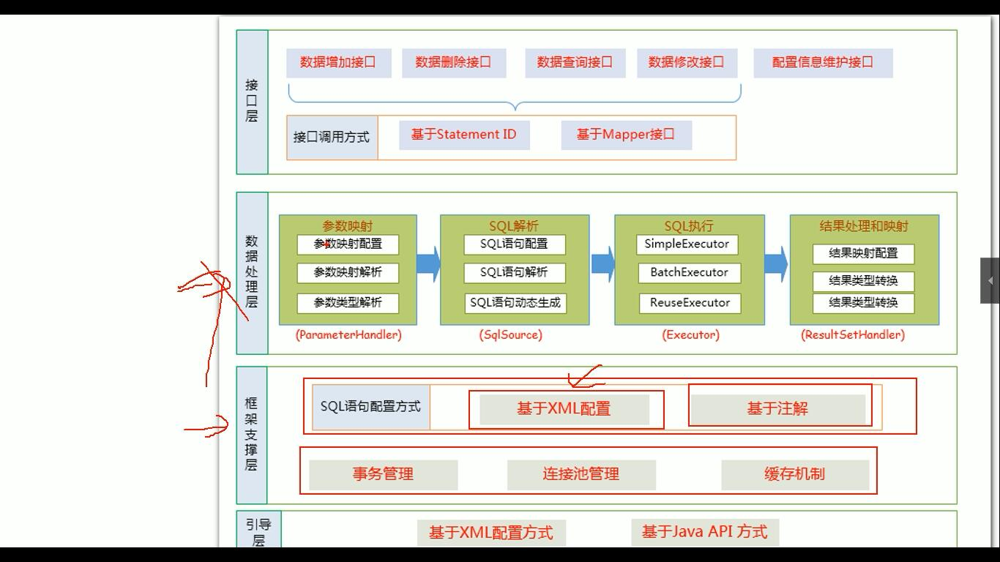

src下的com文件夹是mybatis逆向生成。
src下的其他文件夹是ssm整合

mybatis运行原理

一个MappedStatement代表一个增删改查标签的详细信息

Configuration对象保存了所有配置文件的详细信息，包括全局配置和mapper.xml的配置文件中的信息
configuration中有mappedStatement,mapperRegistry
mappedStatement：{namespace.id==>mappedStatement}
mapperRegistry：{mapper.java==>MapperProxyFactory}

mybatis具体的原理图在mybatis.ppx中查看。

1.获取sqlSessionFactory对象
    解析文件的每一个信息保存在Configuration中，返回包含Configuration的DefaultSqlSessionFactory
    注意：mappedStatement代表一个增删改查标签的详细信息
2.获取SqlSession对象
    返回SqlSession的实现类DefaultSqlSession对象。
    他里面包含了Executor和Configuration；
    Executor会在这一步被创建
3.getMapper（）方法获取mapper代理对象：
    getMapper使用MapperProxyFactory创建一个mapperProxy的代理对象
    代理对象里面包含了defaultSqlSession（Executor）
4.执行增删改查方法

总结：
根据配置文件（全局，和sql映射）初始化Configuration对象，
2.创建一个DefaultSqlSession对象，
    他里面包含Configuration以及
    Executor（根据全局配置文件中的defaultExecutorType创建出对应的executor）
3.DefaultSqlSession.getMapper(),拿到mapper接口对应的MapperProxy
4.MapperProxy里面有（DefaultSqlSession）。
5.执行增删改查方法：
    1.调用DefaultSqlSession对的增删改查方法（executor的增删改查）
    2.会创建一个statementHandler对象,
        (同时也会创建parameterHandler和ResultSetHandler)
    3.调用statementHandler的预编译及设置参数值，使用parameterHandler给sql设置参数
    4.调用statementHandler的增删改查
    5.ResultSetHandler封装结果
注意：四大对象每个创建的时候都有一个

